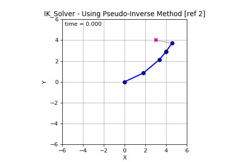
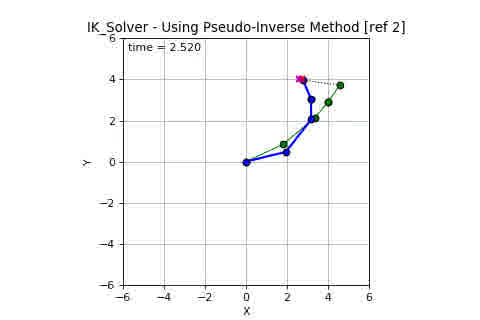
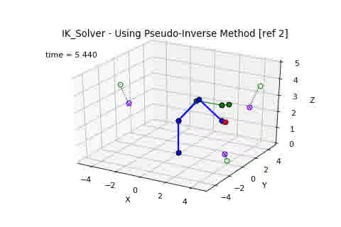

## IK_Solver ##
IK_Solver - Inverse Kinematic Solver for n-link serial chain

The interactive IK_Solver program graphically demonstrates implementation of
several inverse kinematic solving techniques, as presented in the referenced documents,
for two and three dimensional, revolute joint, n-link serial chains. The program
is written entirely in version 2 and 3 compatible [Python](https://www.python.org/)
and requires [SciPy](https://www.scipy.org/), primarily for [NumPy](http://www.numpy.org/) and [Matplotlib](https://matplotlib.org/)
packages. A [MATLAB](https://www.mathworks.com/products/matlab.html)/[Octave](https://www.gnu.org/software/octave/)
script variant is also provided in the ./MATLAB subdirectory of this distribution.
For both Python and MATLAB/Octave variants, a video encoder application, such as
[ffmeg](https://ffmpeg.org/) or avconv from [Libav](https://libav.org/about/),
is required to record graphic animations.

The following images and hyperlinked video clips depict the motion of two dimensional
(2D) and three dimensional (3D) five revolute joint, 4-link serial chains (blue line)
as the end-effector moves from its initial position (green line) towards a moving target
(red x). Although 14 simulation seconds (140 frames \@ 10FPS) are shown, it only took
2.8 and 5.44 seconds for the 2D and 3D link chains respectively to reach the target. In
both cases the end-effector moves to a predicted intercept point (magenta x) along the
target's path of motion. Joint rotation clamping and rotation rate limiting are utilized
to provide a more realistic simulation of the link chain's movement. Even though only
four links are apparent in the serial chains shown, both actually have five links. A
zero length link separates two orthogonal revolute joints between the last two visible
links; the last link considered as the end-effector.

2D 4-Link Frame 0 | 2D 4-Link Frame 140
----------------- | -------------------
|

3D 4-Link Frame 0 | 3D 4-Link Frame 140
----------------- | -------------------
|

If animation recording is not selected, then during 2D link chain animation the user can move
the cursor to a location within the drawing area and press the middle mouse button to interrupt
IK solving and place the target at the picked location. The link chain end-effector will then
be directed toward intercepting the target as it moves from its new location. For non-recorded
3D link chain animation, pressing the middle mouse button causes the target to move to a randomly
generated position -- left and right button presses combined with mouse motion will rotate, zoom
and pan the 3D view space as determined by the Matplotlib figure manager and backend renderer.
IK solving and link chain animation will stop when one of the following conditions occurs:
1) the end-effector reaches the target (within 4% of the effector's length),
2) it's determined the end-effector cannot reach the target, or
3) 30 seconds has elapsed.

Closing the graphic animation window will terminate processing and the program will exit.

#### Getting Started ####

The IK_Solver program can be executed in two different configurations,
as a single executable program, or as client/server programs.

1. To invoke as a single program, execute the following command in
   a terminal window.

     > python IK_Solver.py $1 $2 $3

   where the command line arguments $1, $2 and $3 can be as follows.

     $1 - The IK solver method option \[1,2,3,4,5] where:

            1 = Cyclic Coordinate Descent (CCD)
            2 = Jacobian Transpose Method (JTM)
            3 = Pseudo-inverse Jacobian method 2 (PIM2)
            4 = Pseudo-inverse Jacobian method 3 (PIM3)
            5 = Damped Least Squares (DLS)

     $2 - The reference frame and plotting mode (0=2D, 1=3D).

     $3 - The animation recording switch (0=Off, 1=On). Note that
          animation recording requires ffmpeg or avconv.

2. To invoke as a client/server programs, first start the server
   program in a terminal window using the following command.

     > python IK_Solver_server.py

   Next, start the client program in another terminal window using
   the command:

     > python IK_Server_client.py $1 $2 $3

   where the command line arguments are the same as those presented
   above for the single executable program.

The n-link chain is defined in the IK_Solver_nlink.py file using displacement and
rotation direction vectors, and not with Denavit-Hartenberg (DH) parameters. The
target's initial position and fixed velocity are hard-coded in the IK_Solver_class.py
file. For a 2D case, the pseudo-inverse null space is used to coerce the orienation
of the end-effector link segment to be pointing in the +X direction for the PIM3 and
DLS methods. Similarly for the 3D case, the null space is used to coerce the
end-effector link segment to be pointing in the +X direction.

The utility of the IK_Solver client/server configuration will become apparent
when it's revealed how IK_Solver can be used to drive an IK skeleton rigged
robot in [Blender](https://www.blender.org)!

#### Further Attention ####

* The interactive feature of the program is disabled when animation recording
is selected. If frame images are saved after each figure drawing update, then
the interactive feature may not have to be deactivated and a video
could be assembled from the sequence of saved images as a post-process.
* The name and location of the saved video file is not currently a user specifiable option.
* Instead of the target velocity being hard coded, it could be generated by a
parametric function or read from a trajectory file.
* Animation functions in IK_Solver.py and IK_Solver_client.py could be consolidated
into a class to eliminate duplicative code.
* Enhancements to target intercept prediction could include earliest possible intercept,
and smoothing and filtering to reduce prediction error.
* Python logging could be used instead of verbose print statements
being manually uncommented/commented for debug, test and operational phases
of the program's development and maintenance.

#### References ####

\[1] Benjamin Kenwright, "Practical 01: Inverse Kinematics", September
     2014, School of Computer Science, Edinburgh Napier University,
     United Kingdom, Physics-Based Animation practical web available at
     http://games.soc.napier.ac.uk/study/pba_practicals/Practical%2001%20-%20Inverse%20Kinematics.pdf

\[2] Ben Kenwright, "Real-Time Character Inverse Kinematics using
     the Gauss-Seidel Iterative Approximation Method", July 2012,
     CONTENT 2012, The Fourth International Conference on Creative
     Content Technologies, web available at
     http://www.thinkmind.org/index.php?view=article&articleid=content_2012_4_10_60013

\[3] Samuel R. Buss, "Introduction to Inverse Kinematics with Jacobian
     Transpose, Pseudoinverse and Damped Least Squares methods", October
     2009, Department of Mathematics, University of California, San
     Diego, unpublished article web available at
     http://www.math.ucsd.edu/~sbuss/ResearchWeb/ikmethods/iksurvey.pdf

These reference documents are provided in the ./refs subdirectory in the event
their associated web links are broken. For additional reference information,
software, demos and tutorials on physics-based animation, inverse kinematics
and 3D computer graphics see Ben Kenwright's [XBDEV.NET](http://www.xbdev.net/index.php)
website, Edinburgh Napier University Games Development [Resources](http://games.soc.napier.ac.uk/resources.html), and Sam Buss's [Publications and Other Research](http://www.math.ucsd.edu/~sbuss/ResearchWeb/index.html) web page.

#### Disclaimers ####

* See the file [DISCLAIMER](./DISCLAIMER)

#### Epilogue ####

Python purists and the omnipotent PEP 8 style and naming conventions enforcement
agents will no doubt take extreme umbrage to the IK_Solver program source code.
For those grown accustomed to using IDEs with GUIs, editors with color and layout
schemes, automated code inspection and refactoring, computers with wide screen
high-def monitors, gigabytes of memory and storage, and gigahertz CPUs/GPUs,
I present the user interface of my early programming experience.

Electromechanical typing and only 80 characters; tabbing, spacing and verbose statements
were a luxury, not a necessity. And no, that's not me or my dad in the YouTube
video presented when you click on the Hollerith card image.

The IK_Solver program's primary role is as a simple demonstration and learning tool for
inverse kinematic algorithms, animated graphics and client/server communication.
It is not intended to be representative of commercial software engineering
practices. With the aforementioned capabilities and features of modern software
development platforms, users of IK_Solver are well equipped to tailor the source
code to their needs and whims.

Respectfully,

Gary E. Deschaines
